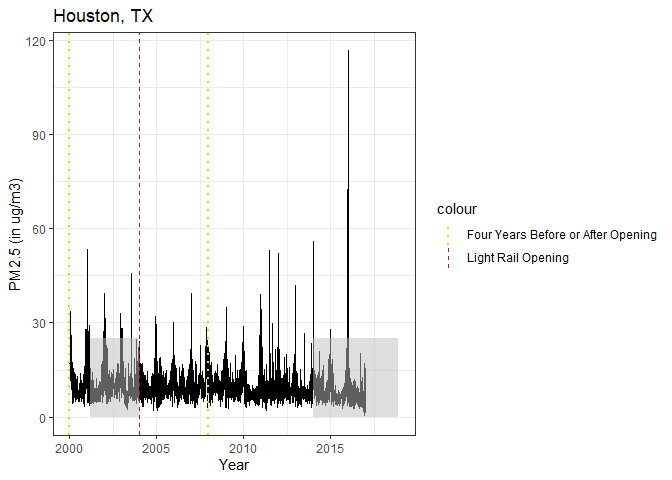
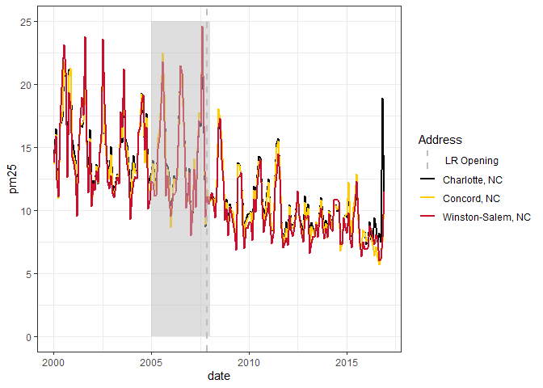
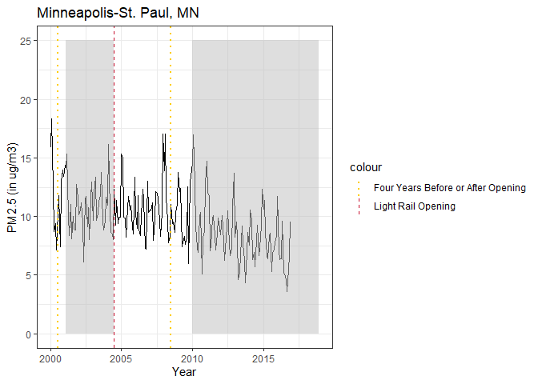
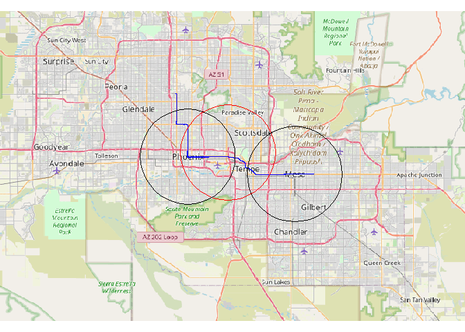
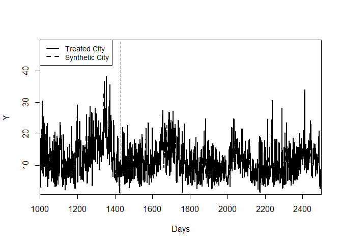
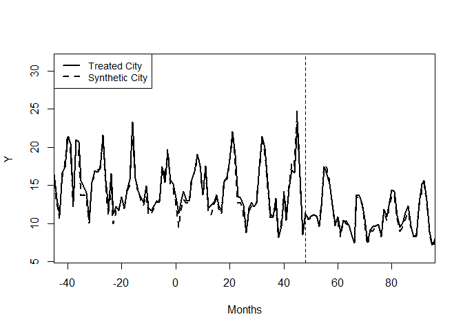
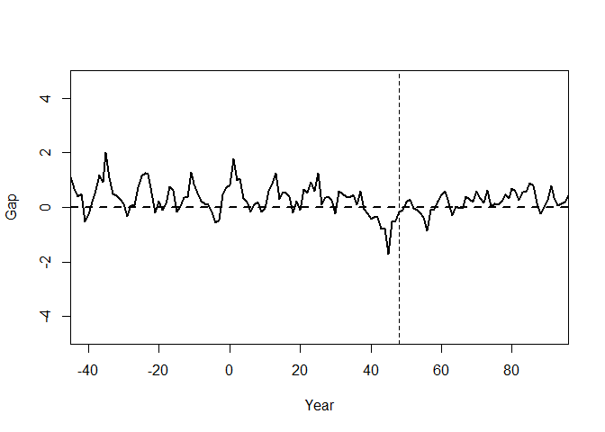

# Do Light Rails Provide the Track to Cleaner Air?
FIRE Sustainability Analytics
2024-03-03

## Treatment Criteria

- As Di et al. (2021) provides data from 2000 to 2016, candidate
  treatment cities must have light rails that opened from January 2004
  to December 2012 in order to have four years of data before and after
  light rail opening.

- Treatment cities must have no increase heavy rail usage in the four
  years before and after opening window.

<table style="width:97%;">
<colgroup>
<col style="width: 20%" />
<col style="width: 18%" />
<col style="width: 28%" />
<col style="width: 14%" />
<col style="width: 14%" />
</colgroup>
<thead>
<tr class="header">
<th>City</th>
<th>Opening Month</th>
<th>Construction</th>
<th>Eval Start</th>
<th>Eval Ends</th>
</tr>
</thead>
<tbody>
<tr class="odd">
<td>Charlotte, NC</td>
<td>Nov 2007</td>
<td>
Mar 2005 - Nov 2007,

Dec 2012 onwards
</td>
<td>Nov 2003</td>
<td>Nov 2011</td>
</tr>
<tr class="even">
<td>Houston, TX</td>
<td>Jan 2004</td>
<td>
March 2001 - Jan 2004,

Jan 2014 onwards
</td>
<td>Jan 2000</td>
<td>Jan 2008</td>
</tr>
<tr class="odd">
<td>Twin Cities, MN</td>
<td>Jun 2004</td>
<td>
Feb 2001 - Jun 2004

Jan 2010 onwards
</td>
<td>Jun 2000</td>
<td>Jun 2008</td>
</tr>
<tr class="even">
<td>Phoenix, AZ</td>
<td>Dec 2008</td>
<td>
July 2005 - Dec 2008

July 2012 onwards
</td>
<td>Dec 2004</td>
<td>Dec 2012</td>
</tr>
</tbody>
</table>

## Control cities

Control cities for **Charlotte** are cities in South Carolina and North
Carolina with no rails and no light rails.

Control cities for **Houston** are other cities in Texas with no rails,
no light rails, and less than 5% of other forms of other transportation
in light rail opening year.

Control cities for the **Twin Cities** are other cities in Minnesota and
Wisconsin with no rails, no light rails, and less than 5% of other forms
of other transportation in light rail opening year.

Control cities for **Phoenix-Mesa** are cities in other Arizona
metropolitan areas with no rails and no light rails.

## Data

### PM2.5

As particulate matter is one of the most damaging air pollutants, we use
ground-level PM2.5 concentrations to represent city-level air quality.
PM2.5 data comes from Di et al. (2019), which provides daily PM2.5
concentrations in grid cells at a resolution of 1 km for the years 2000
to 2016. We then find the monthly average PM2.5 concentration within a
10 km buffer area around each city’s population centroid for the three
treatment cities: Charlotte, Houston, Texas, and Minneapolis-St. Paul.
As the Valley Metro Rail connects two cities, Phoenix and Mesa, Arizona,
we find the average PM2.5 concentration for the 10 km buffer areas
around both cities’ population centroid for each month.

The 10 km radius around the population centroid is the black line, and
the 10 km buffer radius around the light rail centroid is the red line.

    Warning: package 'maptiles' was built under R version 4.3.2

### Meteorology

To take into account meteorological conditions, we include total
precipitation, snowfall, humidity, air density, wind speed, and air
temperature from NASA’s Modern-Era Retrospective Analysis for Research
and Applications version 2 (MERRA-2), which provides these
meteorological values every day at a grid cell resolution of 0.625
degrees x 0.5 degrees. We then calculate the monthly average values for
each meteorological variable within the 10 km buffer areas of treatment
and control cities.

## Synthetic Control

For each city, we minimized the sum of squared residuals for the time
period from Jan 2000 to the beginning of light rail construction.

We omitted results from Houston and the Twin Cities because the
pre-construction number of observations is very low.

### Charlotte

    X1, X0, Z1, Z0 all come directly from dataprep object.

    **************** 
     searching for synthetic control unit  
     

    **************** 
    **************** 
    **************** 

    MSPE (LOSS V): 0.4990884 

    solution.v:
     0.0002331608 0.1807033 0.01281216 0.06099616 0.0005176617 0.09566328 0.1516587 0.2424662 0.04420588 0.04742142 0.001435258 0.1618868 

    solution.w:
     0.01497714 0.004546717 0.08851375 0.7262575 0.02368774 0.01274948 0.01736156 0.007751335 0.003160997 0.1009938 

    $tab.pred
               Treated Synthetic Sample Mean
    PRECTOT      0.000     0.000       0.000
    PRECSNO      0.000     0.000       0.000
    QSH          0.009     0.009       0.010
    RHOA         1.191     1.192       1.192
    SPEED        4.881     5.299       5.230
    TLML       289.073   288.949     289.571
    PRECTOT2     0.000     0.000       0.000
    PRECSNO2     0.000     0.000       0.000
    QSH2         0.000     0.000       0.000
    RHOA2        1.419     1.422       1.422
    SPEED2      24.328    28.748      28.121
    TLML2    83624.007 83553.296   83909.254

    $tab.v
             v.weights
    PRECTOT  0        
    PRECSNO  0.181    
    QSH      0.013    
    RHOA     0.061    
    SPEED    0.001    
    TLML     0.096    
    PRECTOT2 0.152    
    PRECSNO2 0.242    
    QSH2     0.044    
    RHOA2    0.047    
    SPEED2   0.001    
    TLML2    0.162    

    $tab.w
       w.weights                      unit.names unit.numbers
    2      0.015                   Asheville, NC            2
    3      0.005 Charleston-North Charleston, SC            3
    4      0.089                    Columbia, SC            4
    5      0.726                     Concord, NC            5
    6      0.024                      Durham, NC            6
    7      0.013                Fayetteville, NC            7
    8      0.017                  Greenville, SC            8
    9      0.008    Myrtle Beach-Socastee, SC-NC            9
    10     0.003                  Wilmington, NC           10
    11     0.101               Winston-Salem, NC           11

    $tab.loss
              Loss W    Loss V
    [1,] 0.005410736 0.4990884

### Phoenix-Mesa

    X1, X0, Z1, Z0 all come directly from dataprep object.

    **************** 
     searching for synthetic control unit  
     

    **************** 
    **************** 
    **************** 

    MSPE (LOSS V): 17.55961 

    solution.v:
     0.09007563 0.01064422 0.0004542988 0.164535 0.1501265 0.000399553 0.08557806 0.004826011 0.01675006 0.2821431 0.1489733 0.04549433 

    solution.w:
     2.808e-07 3.501e-07 0.9999994 

    $tab.pred
               Treated Synthetic Sample Mean
    PRECTOT      0.000     0.000       0.000
    PRECSNO      0.000     0.000       0.000
    QSH          0.006     0.006       0.006
    RHOA         1.123     1.067       1.029
    SPEED        4.756     5.126       5.454
    TLML       295.949   292.686     289.489
    PRECTOT2     0.000     0.000       0.000
    PRECSNO2     0.000     0.000       0.000
    QSH2         0.000     0.000       0.000
    RHOA2        1.263     1.139       1.061
    SPEED2      22.828    26.759      30.427
    TLML2    87645.447 85716.409   83867.320

    $tab.v
             v.weights
    PRECTOT  0.09     
    PRECSNO  0.011    
    QSH      0        
    RHOA     0.165    
    SPEED    0.15     
    TLML     0        
    PRECTOT2 0.086    
    PRECSNO2 0.005    
    QSH2     0.017    
    RHOA2    0.282    
    SPEED2   0.149    
    TLML2    0.045    

    $tab.w
      w.weights       unit.names unit.numbers
    2         0    Flagstaff, AZ            2
    3         0 Sierra Vista, AZ            3
    4         1       Tucson, AZ            4

    $tab.loss
            Loss W   Loss V
    [1,] 0.8397809 17.55961

## Regressions

Regressions with Charlotte and its 13 control cities.

Column 1 has month and year fixed effects.

Column 2 has month, year, and city fixed effects.

Column 1 has month and year fixed effects.

For all regressions, we restrict data up to 4 years after light rail
opening date.

    =========================================================================
                                         Dependent variable:                 
                        -----------------------------------------------------
                                              ln(PM25)                       
                               (1)               (2)               (3)       
    -------------------------------------------------------------------------
    opentime                 0.109**           0.080*            0.107**     
                             (0.053)           (0.044)           (0.053)     
                                                                             
    treatcity               0.066***                            0.077***     
                             (0.017)                             (0.021)     
                                                                             
    PRECTOT               -1,667.143***     -1,228.535***     -1,667.272***  
                            (233.798)         (204.808)         (233.803)    
                                                                             
    PRECSNO                                                                  
                                                                             
                                                                             
    QSH                    -44.141***        -29.350***        -44.190***    
                             (3.709)           (4.289)           (3.710)     
                                                                             
    RHOA                     -9.409          -30.043***          -9.413      
                             (6.586)           (7.766)           (6.586)     
                                                                             
    SPEED                   -0.286***         -0.249***         -0.287***    
                             (0.057)           (0.049)           (0.057)     
                                                                             
    TLML                    -0.335***         -0.407***         -0.336***    
                             (0.084)           (0.070)           (0.084)     
                                                                             
    PRECTOT2                                                                 
                                                                             
                                                                             
    PRECSNO2                                                                 
                                                                             
                                                                             
    QSH2                                                                     
                                                                             
                                                                             
    RHOA2                     4.090           13.038***           4.092      
                             (2.765)           (2.861)           (2.765)     
                                                                             
    SPEED2                  0.021***           0.011**          0.021***     
                             (0.005)           (0.004)           (0.005)     
                                                                             
    TLML2                   0.001***          0.001***          0.001***     
                            (0.0001)          (0.0001)          (0.0001)     
                                                                             
    opentime:treatcity       -0.029            -0.031            -0.041      
                             (0.029)           (0.024)           (0.032)     
                                                                             
    treatcity:constime                                           -0.034      
                                                                 (0.035)     
                                                                             
    -------------------------------------------------------------------------
    Observations              1,573             1,573             1,573      
    R2                        0.683             0.786             0.683      
    Adjusted R2               0.676             0.780             0.676      
    Residual Std. Error 0.157 (df = 1539) 0.130 (df = 1530) 0.157 (df = 1538)
    =========================================================================
    Note:                                         *p<0.1; **p<0.05; ***p<0.01

Regressions with Charlotte and its 3 closely-matched cities from
synthetic control.

    ======================================================================
                                       Dependent variable:                
                        --------------------------------------------------
                                             ln(PM25)                     
                              (1)              (2)              (3)       
    ----------------------------------------------------------------------
    opentime                 0.070            0.084            0.065      
                            (0.066)          (0.065)          (0.066)     
                                                                          
    treatcity               -0.040**                           -0.029     
                            (0.016)                           (0.019)     
                                                                          
    PRECTOT                                                               
                                                                          
                                                                          
    PRECSNO                                                               
                                                                          
                                                                          
    QSH                    -33.161***       -28.640***       -33.218***   
                            (6.098)          (6.182)          (6.098)     
                                                                          
    RHOA                  -113.656***       -86.710***      -114.206***   
                            (22.392)         (23.228)         (22.396)    
                                                                          
    SPEED                   -0.248**        -0.263***         -0.249**    
                            (0.098)          (0.096)          (0.098)     
                                                                          
    TLML                    -0.282**        -0.304***         -0.283**    
                            (0.116)          (0.114)          (0.116)     
                                                                          
    PRECTOT2                                                              
                                                                          
                                                                          
    PRECSNO2                                                              
                                                                          
                                                                          
    QSH2                                                                  
                                                                          
                                                                          
    RHOA2                  47.558***        39.967***        47.788***    
                            (9.320)          (9.404)          (9.321)     
                                                                          
    SPEED2                   0.010            0.012            0.010      
                            (0.009)          (0.009)          (0.009)     
                                                                          
    TLML2                   0.001***         0.001***         0.001***    
                            (0.0002)         (0.0002)         (0.0002)    
                                                                          
    opentime:treatcity       -0.015           -0.015           -0.025     
                            (0.024)          (0.023)          (0.026)     
                                                                          
    treatcity:constime                                         -0.030     
                                                              (0.029)     
                                                                          
    ----------------------------------------------------------------------
    Observations              572              572              572       
    R2                       0.810            0.816            0.810      
    Adjusted R2              0.798            0.805            0.798      
    Residual Std. Error 0.116 (df = 539) 0.114 (df = 537) 0.116 (df = 538)
    ======================================================================
    Note:                                      *p<0.1; **p<0.05; ***p<0.01

Regressions with Houston and its 13 control cities.

    =========================================================================
                                         Dependent variable:                 
                        -----------------------------------------------------
                                              ln(PM25)                       
                               (1)               (2)               (3)       
    -------------------------------------------------------------------------
    opentime                -0.141***         -0.155***         -0.137**     
                             (0.054)           (0.048)           (0.054)     
                                                                             
    treatcity               0.330***                            0.256***     
                             (0.027)                             (0.049)     
                                                                             
    PRECTOT                -612.465**       -1,136.482***      -614.493**    
                            (281.018)         (254.271)         (280.758)    
                                                                             
    PRECSNO                                                                  
                                                                             
                                                                             
    QSH                      -5.762            -4.635            -5.490      
                             (9.871)           (9.119)           (9.863)     
                                                                             
    RHOA                    25.145***         20.949**          25.165***    
                             (3.919)           (9.544)           (3.915)     
                                                                             
    SPEED                   -0.262***          -0.062           -0.259***    
                             (0.057)           (0.053)           (0.057)     
                                                                             
    TLML                     -0.011           -0.232**           -0.013      
                             (0.110)           (0.098)           (0.110)     
                                                                             
    PRECTOT2                                                                 
                                                                             
                                                                             
    PRECSNO2                                                                 
                                                                             
                                                                             
    QSH2                   -972.610***         437.260         -986.514***   
                            (341.044)         (330.674)         (340.811)    
                                                                             
    RHOA2                   -9.739***         -6.056**          -9.748***    
                             (1.719)           (3.008)           (1.717)     
                                                                             
    SPEED2                  0.015***            0.003           0.014***     
                             (0.004)           (0.004)           (0.004)     
                                                                             
    TLML2                    0.00002          0.0005***          0.00003     
                            (0.0002)          (0.0002)          (0.0002)     
                                                                             
    opentime:treatcity       -0.003            0.0001             0.071      
                             (0.037)           (0.032)           (0.055)     
                                                                             
    treatcity:constime                                           0.104*      
                                                                 (0.057)     
                                                                             
    -------------------------------------------------------------------------
    Observations              1,261             1,261             1,261      
    R2                        0.569             0.675             0.570      
    Adjusted R2               0.558             0.664             0.559      
    Residual Std. Error 0.175 (df = 1229) 0.152 (df = 1218) 0.174 (df = 1228)
    =========================================================================
    Note:                                         *p<0.1; **p<0.05; ***p<0.01

Regressions with the Twin Cities and its 13 control cities.

    ======================================================================
                                       Dependent variable:                
                        --------------------------------------------------
                                             ln(PM25)                     
                              (1)              (2)              (3)       
    ----------------------------------------------------------------------
    opentime                 0.058           0.081**           0.055      
                            (0.052)          (0.039)          (0.052)     
                                                                          
    treatcity                -0.038                            0.011      
                            (0.033)                           (0.063)     
                                                                          
    PRECTOT                 664.640         737.209**         645.639     
                           (478.161)        (356.431)        (478.666)    
                                                                          
    PRECSNO                                                               
                                                                          
                                                                          
    QSH                    45.348***        -22.547**        46.039***    
                            (13.090)         (10.550)         (13.114)    
                                                                          
    RHOA                   -80.702***       -50.385**        -80.189***   
                            (25.666)         (22.644)         (25.676)    
                                                                          
    SPEED                    -0.232           -0.112           -0.229     
                            (0.177)          (0.131)          (0.177)     
                                                                          
    TLML                     -0.082           -0.091           -0.080     
                            (0.136)          (0.101)          (0.136)     
                                                                          
    PRECTOT2                                                              
                                                                          
                                                                          
    PRECSNO2                                                              
                                                                          
                                                                          
    QSH2                                                                  
                                                                          
                                                                          
    RHOA2                  35.573***        25.094***        35.368***    
                            (10.410)         (8.633)          (10.414)    
                                                                          
    SPEED2                   0.011            -0.002           0.010      
                            (0.012)          (0.009)          (0.012)     
                                                                          
    TLML2                    0.0003          0.0003*           0.0003     
                            (0.0002)         (0.0002)         (0.0002)    
                                                                          
    opentime:treatcity       -0.010           -0.021           -0.059     
                            (0.044)          (0.033)          (0.069)     
                                                                          
    treatcity:constime                                         -0.065     
                                                              (0.070)     
                                                                          
    ----------------------------------------------------------------------
    Observations              612              612              612       
    R2                       0.527            0.742            0.528      
    Adjusted R2              0.503            0.727            0.503      
    Residual Std. Error 0.203 (df = 581) 0.150 (df = 577) 0.203 (df = 580)
    ======================================================================
    Note:                                      *p<0.1; **p<0.05; ***p<0.01

Regressions with Phoenix-Mesa, AZ

    ======================================================================
                                       Dependent variable:                
                        --------------------------------------------------
                                             ln(PM25)                     
                              (1)              (2)              (3)       
    ----------------------------------------------------------------------
    opentime                                                              
                                                                          
                                                                          
    treatcity                -0.085                            -0.072     
                            (0.057)                           (0.059)     
                                                                          
    PRECTOT                                                               
                                                                          
                                                                          
    PRECSNO                                                               
                                                                          
                                                                          
    QSH                    -32.305***       -36.915***       -32.998***   
                            (8.161)          (9.082)          (8.197)     
                                                                          
    RHOA                  -104.592***      -125.495***      -104.608***   
                            (10.229)         (21.883)         (10.231)    
                                                                          
    SPEED                  -0.507***        -0.515***        -0.516***    
                            (0.120)          (0.123)          (0.121)     
                                                                          
    TLML                     -0.006           -0.087           -0.006     
                            (0.136)          (0.159)          (0.136)     
                                                                          
    PRECTOT2                                                              
                                                                          
                                                                          
    PRECSNO2                                                              
                                                                          
                                                                          
    QSH2                                                                  
                                                                          
                                                                          
    RHOA2                  50.452***        57.609***        50.459***    
                            (4.860)          (7.798)          (4.860)     
                                                                          
    SPEED2                  0.046***         0.047***         0.047***    
                            (0.010)          (0.011)          (0.010)     
                                                                          
    TLML2                    0.0001           0.0002           0.0001     
                            (0.0002)         (0.0003)         (0.0002)    
                                                                          
    opentime:treatcity       -0.051           -0.051          -0.066*     
                            (0.036)          (0.036)          (0.040)     
                                                                          
    treatcity:constime                                         -0.037     
                                                              (0.041)     
                                                                          
    ----------------------------------------------------------------------
    Observations              624              624              624       
    R2                       0.765            0.766            0.765      
    Adjusted R2              0.752            0.752            0.752      
    Residual Std. Error 0.181 (df = 591) 0.181 (df = 589) 0.181 (df = 590)
    ======================================================================
    Note:                                      *p<0.1; **p<0.05; ***p<0.01

Regression with all treated and control cities.

Column 1 and 3 have month, year, and city group fixed effects. Standard
errors are clustered at the group level.

Column 2 has month, year, and city fixed effects. Standard errors are
clustered at the city level.

    =========================================================================
                                         Dependent variable:                 
                        -----------------------------------------------------
                                              ln(PM25)                       
                               (1)               (2)               (3)       
    -------------------------------------------------------------------------
    opentime                  0.039            0.033*             0.041      
                             (0.019)           (0.018)           (0.023)     
                                                                             
    treatcity                 0.133                               0.125      
                             (0.063)                             (0.054)     
                                                                             
    PRECTOT                -1,277.768*      -1,839.200***      -1,277.434*   
                            (451.653)         (354.919)         (452.910)    
                                                                             
    PRECSNO                                                                  
                             (0.000)           (0.000)           (0.000)     
                                                                             
    QSH                      -34.728          -45.550**          -34.722     
                            (45.553)          (17.510)          (45.517)     
                                                                             
    RHOA                      1.877            -8.542             1.932      
                            (12.676)          (15.289)          (12.822)     
                                                                             
    SPEED                   -0.434**          -0.280***         -0.434**     
                             (0.102)           (0.080)           (0.102)     
                                                                             
    TLML                     -0.050            -0.028            -0.051      
                             (0.301)           (0.181)           (0.302)     
                                                                             
    PRECTOT2                                                                 
                             (0.000)           (0.000)           (0.000)     
                                                                             
    PRECSNO2                                                                 
                             (0.000)           (0.000)           (0.000)     
                                                                             
    QSH2                     946.608        2,401.849***         943.627     
                           (1,908.163)        (876.298)        (1,915.182)   
                                                                             
    RHOA2                     0.218             6.383             0.195      
                             (5.614)           (6.082)           (5.674)     
                                                                             
    SPEED2                   0.029**          0.017***           0.029**     
                             (0.008)           (0.006)           (0.008)     
                                                                             
    TLML2                    0.0001            0.0001            0.0001      
                             (0.001)          (0.0003)           (0.001)     
                                                                             
    opentime:treatcity        0.004            -0.002             0.012      
                             (0.023)           (0.045)           (0.055)     
                                                                             
    treatcity:constime                                            0.015      
                                                                 (0.064)     
                                                                             
    -------------------------------------------------------------------------
    Observations              4,070             4,070             4,070      
    R2                        0.613             0.732             0.613      
    Adjusted R2               0.610             0.728             0.610      
    Residual Std. Error 0.224 (df = 4031) 0.187 (df = 4002) 0.224 (df = 4030)
    =========================================================================
    Note:                                         *p<0.1; **p<0.05; ***p<0.01
