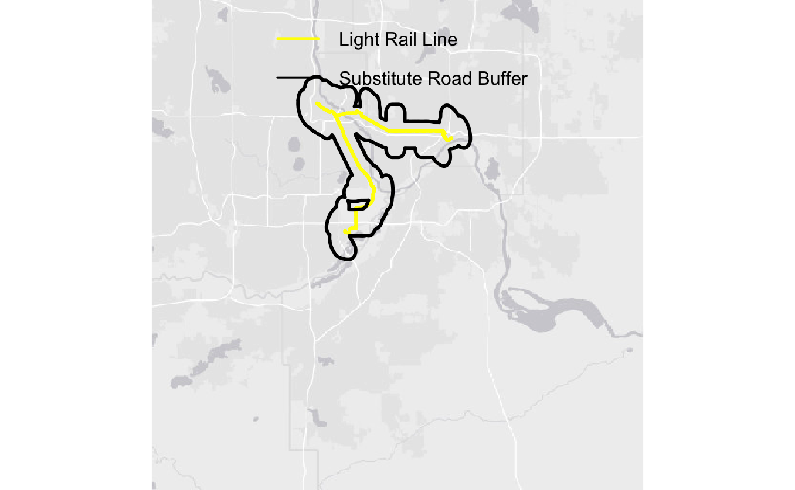

# Do Light Rails Provide the Track to Cleaner Air?
FIRE Sustainability Analytics
2024-09-10

# 1. Introduction

This research project aims to find if light rail openings result in an
overall decrease in air pollution in U.S. urban areas? The answer to
this question will help predict air pollution impacts of the Purple Line
in Maryland that is scheduled to open in 2027.

To examine the potential impact of light rail openings, we will analyze
the outcomes in other U.S. cities with light rail systems, utilizing
ground-level PM2.5 data developed by Di et al. (2021). This data has a
spatial resolution of 1-kilometer grids and a daily temporal resolution
from 2000 to 2016. We will focus on cities where light rail is the
primary mode of rail transit, and no other urban rail systems are
present. Four light rail systems in the United States meet these
criteria: the Lynx Blue Line in Charlotte, North Carolina; the Red
METRORail Line in Houston, Texas; the Blue METRO Line in
Minneapolis-St. Paul, Minnesota; and the Valley Metro Rail in
Phoenix-Mesa, Arizona.

We will employ a difference-in-difference estimation strategy to compare
air pollution trends in cities with light rail openings and control
cities that had similar air pollution trends before the light rail
openings. This will involve determining monthly average PM2.5 levels for
all urban areas in the U.S. We will then use synthetic control methods
to generate data for control cities with pre-light rail pollution trends
similar to each treated city. Subsequently, we will calculate potential
changes in air pollution due to light rail openings.

This research project aims to provide the most rigorous impact
estimation of light rail openings on air pollution to date. While
existing studies suggest that light rails are environmentally superior
to other transportation options, they haven’t conclusively shown that
their opening reduces city-wide air pollution (Mulley et al., 2017; Ham
et al., 2017).

Unlike numerous studies on subway openings, there are limited studies on
light rails. Park & Sener (2019) indicate a 24% decrease in CO measured
from monitors after the opening of the Houston light rail, and Fageda
(2021) suggests a 3% decrease in PM2.5 after light-rail openings in
European cities.

Our study will differ from existing studies on light rail and air
pollution in several ways. Because Park & Sener (2019) analyzed the
change in pollution in only one city, there may be other factors
affecting the change in the pollution that confounds with the opening of
the light rail. Our study will also use higher frequency pollution data
than the annual level used in Fageda (2021), allowing us to control for
meteorological factors. 

As Park & Sener (2019) only included data two years before the light
rail opening, and Fageda (2021) included data three years before the
light rail openings, their findings can confound with the construction
period of light rails. As shown in Figure 1, light rail construction
usually happens around three years before light rail openings. There is
also an increase in PM2.5 levels during the construction period. By
including data only two to three years before light rail openings,
existing studies can overestimate the degree of pollution reduction, as
construction activities can contribute to the higher pollution levels
before light rail openings. 

## 1.2. Treatment Criteria

- As Di et al. (2021) provides data from 2000 to 2016, candidate
  treatment cities must have light rails that opened from January 2004
  to December 2012 in order to have four years of data before and after
  light rail opening.

- Treatment cities must have no increase heavy rail usage in the four
  years before and after opening window.

<table style="width:97%;">
<colgroup>
<col style="width: 20%" />
<col style="width: 18%" />
<col style="width: 28%" />
<col style="width: 14%" />
<col style="width: 14%" />
</colgroup>
<thead>
<tr class="header">
<th>City</th>
<th>Opening Month</th>
<th>Construction</th>
<th>Eval Start</th>
<th>Eval Ends</th>
</tr>
</thead>
<tbody>
<tr class="odd">
<td>Charlotte, NC</td>
<td>Nov 2007</td>
<td><p>Mar 2005 - Nov 2007,</p>
<p>Dec 2012 onwards</p></td>
<td>Nov 2003</td>
<td>Nov 2011</td>
</tr>
<tr class="even">
<td>Houston, TX</td>
<td>Jan 2004</td>
<td><p>March 2001 - Jan 2004,</p>
<p>Jan 2014 onwards</p></td>
<td>Jan 2000</td>
<td>Jan 2008</td>
</tr>
<tr class="odd">
<td>Twin Cities, MN</td>
<td>Jun 2004</td>
<td><p>Feb 2001 - Jun 2004</p>
<p>Jan 2010 onwards</p></td>
<td>Jun 2000</td>
<td>Jun 2008</td>
</tr>
<tr class="even">
<td>Phoenix, AZ</td>
<td>Dec 2008</td>
<td><p>July 2005 - Dec 2008</p>
<p>July 2012 onwards</p></td>
<td>Dec 2004</td>
<td>Dec 2012</td>
</tr>
</tbody>
</table>

## 1.3. Untreated Area for Each Treated Area

The plot below shows number of trips for each mode of revenue-generating
transportation in Charlotte.

Because buses are the primary alternative transportation in the city,
control cities for **Charlotte** are cities that primarily runs on buses
in South Carolina and North Carolina with no rails and no light rails.
This includes, Asheville, NC, Charleston, SC, Columbia, SC, Durham, NC,
Fayetteville, NC, Greenville, SC, Myrtle Beach, SC, Socastee, SC,
Wilmington, NC, and Winston-Salem, NC.


The plot below shows number of trips for each mode of revenue-generating
transportation in Houston.

Control cities for **Houston** are other cities in Texas with no rails,
no light rails, and less than 5% of other forms of other transportation
in light rail opening year. This includes Austin, TX, Beaumont, TX,
Brownsville, TX, College Station, TX, Corpus Christi, TX, Lewisville,
TX, El Paso, TX-NM, Laredo, TX, Lubbock, TX, Odessa, TX, San Antonio,
TX, and Waco, TX.


The plot below shows number of trips for each mode of revenue-generating
transportation in the Twin Cities

Control cities for the **Twin Cities** are other cities in Minnesota and
Wisconsin with no rails, no light rails, and less than 5% of other forms
of other transportation in light rail opening year. This includes
Beloit, WI, Duluth, MN, Rochester, MN, and Wausau, WI.


The plot below shows number of trips for each mode of revenue-generating
transportation in the Phoenix-Mesa.

Control cities for **Phoenix-Mesa** are cities in other Arizona
metropolitan areas with no rails and no light rails. This includes
Flagstaff, AZ, Sierra Vista, AZ, and Tucson, AZ.


# 2. Data

## 2.1. PM2.5 in Treatment Cities

As particulate matter is one of the most damaging air pollutants, we use
ground-level PM2.5 concentrations to represent city-level air quality.
PM2.5 data comes from Di et al. (2019), which provides daily PM2.5
concentrations in grid cells at a resolution of 1 km for the years 2000
to 2016.

For each treated city, we identified which highway light rails could
potentially serve as a substitute, and we extracted daily levels of
PM2.5 in areas within 1 km of those highways.

The black lines in the figure below shows the area we extracted daily
PM2.5 data of the treated cities, Charlotte and the Twin Cities. The
yellow line shows the light rail route of interest.





## 2.2. PM2.5 in Untreated Areas

For each untreated city identified in section 1.3., we draw a 30 km
radius around each city’s centroid, crop interstates segments that fall
within that centroid, and draw 1 km radius around each cropped
interstate. We then find the daily average PM2.5 levels within each 1 km
radius around the cropped interstate area for each city.


## 2.3. Meteorology

To take into account meteorological conditions, we include 48 land
surface meteorological variables provided by NASA Global Land Data
Assimilation System Version 2. The data set provides rasters with a
raster of 0.25 x0.25 degree daily. We then calculate the daily averages
for the treatment and control areas as described above.

# 3. Estimation Methods

## 3.1. Difference-in-Difference

### Charlotte

Trends between treat and untreated groups


``` r
#run difference-in-differences
library("fixest")

summary(m1<-feols(pm25 ~ opentime:trtcity + opentime + Swnet_tavg+Lwnet_tavg+
                   Qle_tavg+Qh_tavg+Qg_tavg+Snowf_tavg+Rainf_tavg+Evap_tavg+Qs_tavg+
                   Qsb_tavg+Qsm_tavg+SnowT_tavg+AvgSurfT_tavg+SWE_tavg+
                   SnowDepth_tavg+SoilMoist_S_tavg+SoilMoist_RZ_tavg+SoilMoist_P_tavg+
                   ECanop_tavg+TVeg_tavg+ESoil_tavg+CanopInt_tavg+EvapSnow_tavg+ACond_tavg+
                   TWS_tavg+GWS_tavg+Wind_f_tavg+Rainf_f_tavg+Tair_f_tavg+Qair_f_tavg+
                   Psurf_f_tavg+SWdown_f_tavg+LWdown_f_tavg|
                   dow + month + year + Address, cluster="Address", data=df2))
```

    The variables 'Qsb_tavg', 'AvgSurfT_tavg' and three others have been removed because of collinearity (see $collin.var).

    OLS estimation, Dep. Var.: pm25
    Observations: 11,572 
    Fixed-effects: dow: 7,  month: 12,  year: 9,  Address: 4
    Standard-errors: Clustered (Address) 
                           Estimate   Std. Error    t value  Pr(>|t|)    
    opentime              -0.198677 4.258520e-01  -0.466541 0.6726186    
    Swnet_tavg             0.030462 3.714600e-02   0.820052 0.4722747    
    Lwnet_tavg            -0.644160 6.006800e-02 -10.723839 0.0017338 ** 
    Qle_tavg              -0.066881 1.954500e-02  -3.421936 0.0417837 *  
    Qh_tavg                0.086480 6.753700e-02   1.280473 0.2904049    
    Qg_tavg                0.125419 7.147300e-02   1.754787 0.1775662    
    Snowf_tavg         15425.621820 5.312629e+03   2.903576 0.0623208 .  
    Rainf_tavg          -752.081928 1.178843e+03  -0.637983 0.5688465    
    Evap_tavg         234737.107503 2.025732e+05   1.158777 0.3304083    
    Qs_tavg            16881.284216 8.191730e+03   2.060772 0.1313987    
    Qsm_tavg          -41229.310232 3.488551e+04  -1.181846 0.3224146    
    SnowT_tavg            -6.979083 6.860500e-01 -10.172852 0.0020241 ** 
    SWE_tavg            1154.283670 1.972428e+03   0.585210 0.5995143    
    SnowDepth_tavg         7.945262 1.607680e+00   4.942068 0.0158916 *  
    SoilMoist_S_tavg      -0.852542 3.531230e-01  -2.414289 0.0946522 .  
    SoilMoist_RZ_tavg   1264.169872 2.087991e+03   0.605448 0.5876148    
    SoilMoist_P_tavg    -110.027905 1.807158e+02  -0.608845 0.5856343    
    ECanop_tavg       153982.270372 3.806939e+04   4.044779 0.0272031 *  
    TVeg_tavg          87346.399078 5.242208e+04   1.666214 0.1942611    
    CanopInt_tavg       1140.506087 1.974833e+03   0.577520 0.6040800    
    ACond_tavg             1.565970 4.346502e+00   0.360283 0.7425081    
    TWS_tavg           -1154.152993 1.972415e+03  -0.585147 0.5995513    
    GWS_tavg            1264.189765 2.088010e+03   0.605452 0.5876124    
    Wind_f_tavg           -1.467053 2.944300e-01  -4.982691 0.0155394 *  
    Tair_f_tavg            4.196564 6.058920e-01   6.926258 0.0061703 ** 
    Qair_f_tavg         -158.223651 3.426908e+01  -4.617097 0.0191199 *  
    Psurf_f_tavg           0.000634 2.760000e-04   2.302190 0.1047778    
    SWdown_f_tavg         -0.082299 4.732100e-02  -1.739177 0.1803859    
    LWdown_f_tavg          0.572947 4.839100e-02  11.839974 0.0012953 ** 
    opentime:trtcity      -0.188123 3.316570e-01  -0.567221 0.6102339    
    ... 5 variables were removed because of collinearity (Qsb_tavg, AvgSurfT_tavg and 3 others [full set in $collin.var])
    ---
    Signif. codes:  0 '***' 0.001 '**' 0.01 '*' 0.05 '.' 0.1 ' ' 1
    RMSE: 4.97751     Adj. R2: 0.353233
                    Within R2: 0.182373

``` r
summary(m2<-feols(log(pm25) ~ opentime:trtcity + opentime + Swnet_tavg+Lwnet_tavg+
                   Qle_tavg+Qh_tavg+Qg_tavg+Snowf_tavg+Rainf_tavg+Evap_tavg+Qs_tavg+
                   Qsb_tavg+Qsm_tavg+SnowT_tavg+AvgSurfT_tavg+SWE_tavg+
                   SnowDepth_tavg+SoilMoist_S_tavg+SoilMoist_RZ_tavg+SoilMoist_P_tavg+
                   ECanop_tavg+TVeg_tavg+ESoil_tavg+CanopInt_tavg+EvapSnow_tavg+ACond_tavg+
                   TWS_tavg+GWS_tavg+Wind_f_tavg+Rainf_f_tavg+Tair_f_tavg+Qair_f_tavg+
                   Psurf_f_tavg+SWdown_f_tavg+LWdown_f_tavg|
                   dow + month + year + Address, cluster="Address", data=df2))
```

    The variables 'Qsb_tavg', 'AvgSurfT_tavg' and three others have been removed because of collinearity (see $collin.var).

    OLS estimation, Dep. Var.: log(pm25)
    Observations: 11,572 
    Fixed-effects: dow: 7,  month: 12,  year: 9,  Address: 4
    Standard-errors: Clustered (Address) 
                          Estimate   Std. Error    t value  Pr(>|t|)    
    opentime              0.029521     0.026241   1.125004 0.3424711    
    Swnet_tavg            0.006342     0.003066   2.068762 0.1303966    
    Lwnet_tavg           -0.049147     0.004960  -9.908840 0.0021863 ** 
    Qle_tavg             -0.002571     0.002158  -1.191382 0.3191679    
    Qh_tavg               0.003520     0.005790   0.607895 0.5861876    
    Qg_tavg               0.008248     0.006003   1.373991 0.2631052    
    Snowf_tavg         1481.124660   446.176661   3.319592 0.0450678 *  
    Rainf_tavg         -183.408102   131.382294  -1.395988 0.2570887    
    Evap_tavg          1695.554511 19069.887224   0.088913 0.9347544    
    Qs_tavg             941.996084   877.596369   1.073382 0.3617580    
    Qsm_tavg          -5970.622488  2939.895313  -2.030896 0.1352271    
    SnowT_tavg           -0.577382     0.054551 -10.584190 0.0018018 ** 
    SWE_tavg            114.018741   162.236183   0.702795 0.5328106    
    SnowDepth_tavg        0.707261     0.109301   6.470779 0.0074897 ** 
    SoilMoist_S_tavg     -0.022963     0.020373  -1.127141 0.3416948    
    SoilMoist_RZ_tavg   108.109261   169.540182   0.637662 0.5690297    
    SoilMoist_P_tavg      5.872698    13.095676   0.448446 0.6842420    
    ECanop_tavg       14832.190665  3789.298398   3.914231 0.0296388 *  
    TVeg_tavg         10178.215881  4771.991123   2.132908 0.1226731    
    CanopInt_tavg       112.796370   162.344302   0.694797 0.5371589    
    ACond_tavg            0.570015     0.214838   2.653225 0.0767818 .  
    TWS_tavg           -113.985004   162.236494  -0.702585 0.5329241    
    GWS_tavg            108.113428   169.541865   0.637680 0.5690193    
    Wind_f_tavg          -0.164437     0.015363 -10.703573 0.0017434 ** 
    Tair_f_tavg           0.344507     0.047053   7.321614 0.0052629 ** 
    Qair_f_tavg          -6.885867     2.866769  -2.401961 0.0957056 .  
    Psurf_f_tavg          0.000073     0.000021   3.503908 0.0393701 *  
    SWdown_f_tavg        -0.007418     0.004046  -1.833412 0.1641108    
    LWdown_f_tavg         0.046436     0.003783  12.276412 0.0011641 ** 
    opentime:trtcity     -0.008383     0.022106  -0.379216 0.7297771    
    ... 5 variables were removed because of collinearity (Qsb_tavg, AvgSurfT_tavg and 3 others [full set in $collin.var])
    ---
    Signif. codes:  0 '***' 0.001 '**' 0.01 '*' 0.05 '.' 0.1 ' ' 1
    RMSE: 0.394454     Adj. R2: 0.39586 
                     Within R2: 0.250005

## Synthetic Control

For each city, we minimized the sum of squared residuals for the time
period from Jan 2000 to the beginning of light rail construction.

# References

Di, Q., Y. Wei, A. Shtein, C. Hultquist, X. Xing, H. Amini, L. Shi, I.
Kloog, R. Silvern, J. Kelly, M. B. Sabath, C. Choirat, P. Koutrakis, A.
Lyapustin, Y. Wang, L. J. Mickley & J. Schwartz. 2021. Daily and Annual
PM2.5 Concentrations for the Contiguous United States, 1-km Grids, v1
(2000 - 2016). Palisades, New York: NASA Socioeconomic Data and
Applications Center (SEDAC). <https://doi.org/10.7927/0rvr-4538>

Fageda, X. (2021). Do light rail systems reduce traffic externalities?
Empirical evidence from mid-size European cities. Transportation
Research Part D: Transport and Environment, 92, 102731.

Ham, W., Vijayan, A., Schulte, N., & Herner, J. D. (2017). Commuter
exposure to PM2. 5, BC, and UFP in six common transport
microenvironments in Sacramento, California. Atmospheric Environment,
167, 335-345.

Houston, D., Dang, A., Wu, J., Chowdhury, Z., & Edwards, R. (2016). The
cost of convenience; air pollution and noise on freeway and arterial
light rail station platforms in Los Angeles. Transportation Research
Part D: Transport and Environment, 49, 127-137.

Mulley, C., Hensher, D. A., & Cosgrove, D. (2017). Is rail cleaner and
greener than bus?. Transportation Research Part D: Transport and
Environment, 51, 14-28.

Park, E. S., & Sener, I. N. (2019). Traffic-related air emissions in
Houston: Effects of light-rail transit. Science of the Total
Environment, 651, 154-161.

Shaver, K. (2013, October 23). Residents concerned about impact of
proposed light-rail Purple Line. The Washington Post.
[https://www.washingtonpost.com/](https://www.washingtonpost.com/local/trafficandcommuting/residents-concerned-about-impacts-of-proposed-light-rail-purple-line/2013/10/23/ffc25d52-3bea-11e3-a94f-b58017bfee6c_story.html)

Texas A&M Transportation Institute. (2016). Light-Rail Transit (LRT) –
Transportation Policy Research.
<https://policy.tti.tamu.edu/strategy/light-rail-transit/>
