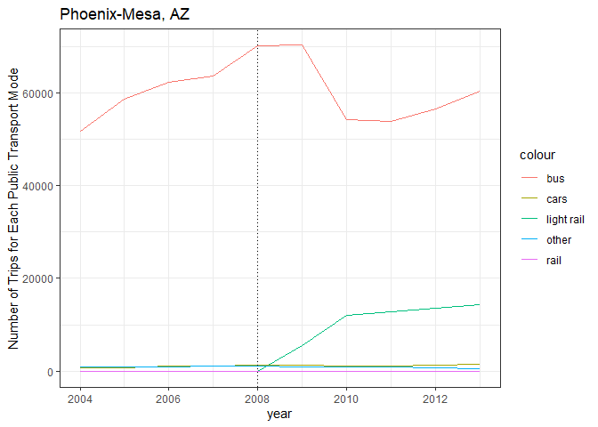
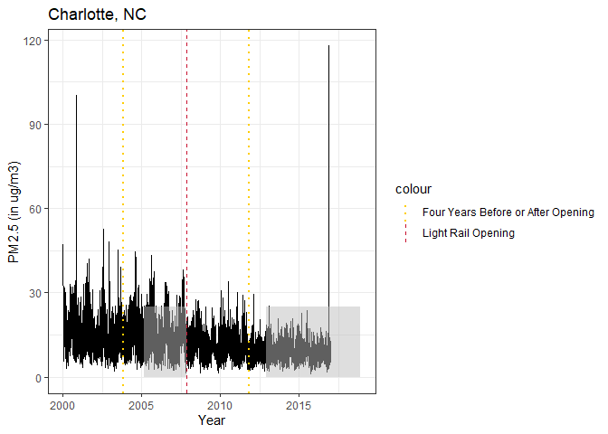
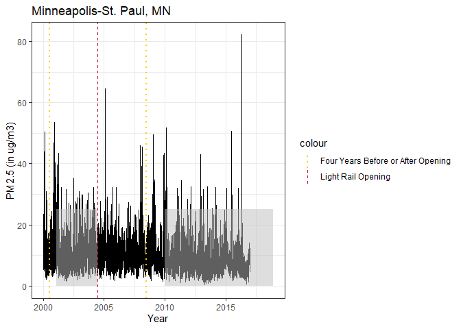

# Do Light Rails Provide the Track to Cleaner Air?
FIRE Sustainability Analytics
2024-09-10

# 1. Introduction

This research project aims to find if light rail openings result in an
overall decrease in air pollution in U.S. urban areas? The answer to
this question will help predict air pollution impacts of the Purple Line
in Maryland that is scheduled to open in 2027.

To examine the potential impact of light rail openings, we will analyze
the outcomes in other U.S. cities with light rail systems, utilizing
ground-level PM2.5 data developed by Di et al. (2021). This data has a
spatial resolution of 1-kilometer grids and a daily temporal resolution
from 2000 to 2016. We will focus on cities where light rail is the
primary mode of rail transit, and no other urban rail systems are
present. Four light rail systems in the United States meet these
criteria: the Lynx Blue Line in Charlotte, North Carolina; the Red
METRORail Line in Houston, Texas; the Blue METRO Line in
Minneapolis-St. Paul, Minnesota; and the Valley Metro Rail in
Phoenix-Mesa, Arizona.

We will employ a difference-in-difference estimation strategy to compare
air pollution trends in cities with light rail openings and control
cities that had similar air pollution trends before the light rail
openings. This will involve determining monthly average PM2.5 levels for
all urban areas in the U.S. We will then use synthetic control methods
to generate data for control cities with pre-light rail pollution trends
similar to each treated city. Subsequently, we will calculate potential
changes in air pollution due to light rail openings.

This research project aims to provide the most rigorous impact
estimation of light rail openings on air pollution to date. While
existing studies suggest that light rails are environmentally superior
to other transportation options, they haven’t conclusively shown that
their opening reduces city-wide air pollution (Mulley et al., 2017; Ham
et al., 2017).

Unlike numerous studies on subway openings, there are limited studies on
light rails. Park & Sener (2019) indicate a 24% decrease in CO measured
from monitors after the opening of the Houston light rail, and Fageda
(2021) suggests a 3% decrease in PM2.5 after light-rail openings in
European cities.

Our study will differ from existing studies on light rail and air
pollution in several ways. Because Park & Sener (2019) analyzed the
change in pollution in only one city, there may be other factors
affecting the change in the pollution that confounds with the opening of
the light rail. Our study will also use higher frequency pollution data
than the annual level used in Fageda (2021), allowing us to control for
meteorological factors. 

As Park & Sener (2019) only included data two years before the light
rail opening, and Fageda (2021) included data three years before the
light rail openings, their findings can confound with the construction
period of light rails. As shown in Figure 1, light rail construction
usually happens around three years before light rail openings. There is
also an increase in PM2.5 levels during the construction period. By
including data only two to three years before light rail openings,
existing studies can overestimate the degree of pollution reduction, as
construction activities can contribute to the higher pollution levels
before light rail openings. 

## 1.2. Treatment Criteria

- As Di et al. (2021) provides data from 2000 to 2016, candidate
  treatment cities must have light rails that opened from January 2004
  to December 2012 in order to have four years of data before and after
  light rail opening.

- Treatment cities must have no increase heavy rail usage in the four
  years before and after opening window.

<table style="width:97%;">
<colgroup>
<col style="width: 20%" />
<col style="width: 18%" />
<col style="width: 28%" />
<col style="width: 14%" />
<col style="width: 14%" />
</colgroup>
<thead>
<tr class="header">
<th>City</th>
<th>Opening Month</th>
<th>Construction</th>
<th>Eval Start</th>
<th>Eval Ends</th>
</tr>
</thead>
<tbody>
<tr class="odd">
<td>Charlotte, NC</td>
<td>Nov 2007</td>
<td>
Mar 2005 - Nov 2007,

Dec 2012 onwards
</td>
<td>Nov 2003</td>
<td>Nov 2011</td>
</tr>
<tr class="even">
<td>Houston, TX</td>
<td>Jan 2004</td>
<td>
March 2001 - Jan 2004,

Jan 2014 onwards
</td>
<td>Jan 2000</td>
<td>Jan 2008</td>
</tr>
<tr class="odd">
<td>Twin Cities, MN</td>
<td>Jun 2004</td>
<td>
Feb 2001 - Jun 2004

Jan 2010 onwards
</td>
<td>Jun 2000</td>
<td>Jun 2008</td>
</tr>
<tr class="even">
<td>Phoenix, AZ</td>
<td>Dec 2008</td>
<td>
July 2005 - Dec 2008

July 2012 onwards
</td>
<td>Dec 2004</td>
<td>Dec 2012</td>
</tr>
</tbody>
</table>

## 1.3. Untreated Area for Each Treated Area

The plot below shows number of trips for each mode of revenue-generating
transportation in Charlotte.

Because buses are the primary alternative transportation in the city,
control cities for **Charlotte** are cities that primarily runs on buses
in South Carolina and North Carolina with no rails and no light rails.
This includes, Asheville, NC, Charleston, SC, Columbia, SC, Durham, NC,
Fayetteville, NC, Greenville, SC, Myrtle Beach, SC, Socastee, SC,
Wilmington, NC, and Winston-Salem, NC.

The plot below shows number of trips for each mode of revenue-generating
transportation in Houston.

Control cities for **Houston** are other cities in Texas with no rails,
no light rails, and less than 5% of other forms of other transportation
in light rail opening year. This includes Austin, TX, Beaumont, TX,
Brownsville, TX, College Station, TX, Corpus Christi, TX, Lewisville,
TX, El Paso, TX-NM, Laredo, TX, Lubbock, TX, Odessa, TX, San Antonio,
TX, and Waco, TX.

The plot below shows number of trips for each mode of revenue-generating
transportation in the Twin Cities

Control cities for the **Twin Cities** are other cities in Minnesota and
Wisconsin with no rails, no light rails, and less than 5% of other forms
of other transportation in light rail opening year. This includes
Beloit, WI, Duluth, MN, Rochester, MN, and Wausau, WI.

The plot below shows number of trips for each mode of revenue-generating
transportation in the Phoenix-Mesa.

Control cities for **Phoenix-Mesa** are cities in other Arizona
metropolitan areas with no rails and no light rails. This includes
Flagstaff, AZ, Sierra Vista, AZ, and Tucson, AZ.

# 2. Data

## 2.1. PM2.5 in Treatment Cities

As particulate matter is one of the most damaging air pollutants, we use
ground-level PM2.5 concentrations to represent city-level air quality.
PM2.5 data comes from Di et al. (2019), which provides daily PM2.5
concentrations in grid cells at a resolution of 1 km for the years 2000
to 2016.

For each treated city, we identified which highway light rails could
potentially serve as a substitute, and we extracted daily levels of
PM2.5 in areas within 1 km of those highways.

The black lines in the figure below shows the area we extracted daily
PM2.5 data of the treated cities, Charlotte and the Twin Cities. The
yellow line shows the light rail route of interest.

## 2.2. PM2.5 in Untreated Areas

For each untreated city identified in section 1.3., we draw a 30 km
radius around each city’s centroid, crop interstates segments that fall
within that centroid, and draw 1 km radius around each cropped
interstate. We then find the daily average PM2.5 levels within each 1 km
radius around the cropped interstate area for each city.

## 2.3. Meteorology

To take into account meteorological conditions, we include 48 land
surface meteorological variables provided by NASA Global Land Data
Assimilation System Version 2. The data set provides rasters with a
raster of 0.25 x0.25 degree daily. We then calculate the daily averages
for the treatment and control areas as described above.

# 3. Estimation Methods

## 3.1. Difference-in-Difference

For each treatment city, we use data from untreated city with similar
public pre-light-rail transportation profiles as controls. Our main
regression specification is:

$$
P_{it}=\gamma (D_i \times Open_t) + W'_{it} \beta +\mu_i + \eta_t + \epsilon_{it}
$$

where $P_{it}$ are PM2.5 levels (in ug/m3) for each city $i$ and day
$t$.

$D_i$ is a dummy variable that is equal to one when city $i$ is the city
with a light rail system.

$Open_t$ is a dummy variable that is equal to one when the light rail
system in the treated city is in operation.

$W_{it}$ includes 48 meteorological control variables in its linear,
square, and cubic form for each city and day.

$\mu_i$ are city fixed effects.

$\eta_t$ is time fixed effects, which is a combination of day of week
fixed effects, month fixed effects, year fixed effects, or day fixed
effects, depending on the specific regression.

### Charlotte

Trends between treat and untreated groups. Area in the grey box
(construction years) are dropped from our main results.

| Estimate | Std. Error | t value | Pr(\>\|t\|) | controls                                               |
|---------:|-----------:|--------:|------------:|:-------------------------------------------------------|
|    -0.21 |       0.47 |   -0.44 |        0.69 | Linear Weather Vars, Day of Week FE, Month FE          |
|    -0.57 |       0.27 |   -2.11 |        0.13 | Linear Weather Vars, Day of Week FE, Month FE, Year FE |
|    -0.66 |       0.56 |   -1.19 |        0.32 | Linear Weather Vars, Day of Week FE, Date FE           |
|    -0.69 |       0.66 |   -1.05 |        0.37 | Cublic Weather Vars, Day of Week FE, Month FE          |
|    -0.73 |       0.45 |   -1.61 |        0.21 | Cublic Weather Vars, Day of Week FE, Month FE, Year FE |
|    -0.72 |    6661.94 |    0.00 |        1.00 | Cublic Weather Vars, Day of Week FE, Date FE           |

Log-linear results

| Estimate | Std. Error | t value | Pr(\>\|t\|) | controls                                               |
|---------:|-----------:|--------:|------------:|:-------------------------------------------------------|
|    -0.04 |       0.02 |   -1.99 |        0.14 | Linear Weather Vars, Day of Week FE, Month FE, Year FE |
|    -0.05 |       0.04 |   -1.25 |        0.30 | Linear Weather Vars, Day of Week FE, Date FE           |
|    -0.06 |       0.02 |   -2.50 |        0.09 | Cublic Weather Vars, Day of Week FE, Month FE, Year FE |
|    -0.05 |     403.77 |    0.00 |        1.00 | Cublic Weather Vars, Day of Week FE, Date FE           |

Day of week heterogeneous treatment effects, with log-linear results

|                               | Estimate | Std. Error | t value | Pr(\>\|t\|) | controls                                              |
|:------------------------------|---------:|-----------:|--------:|------------:|:------------------------------------------------------|
| opentime:trtcity:dowFriday    |    -0.36 |       0.52 |   -0.69 |        0.54 | Cubic Weather Vars, Day of Week FE, Month FE, Year FE |
| opentime:trtcity:dowMonday    |     0.09 |       0.48 |    0.19 |        0.86 | Cubic Weather Vars, Day of Week FE, Month FE, Year FE |
| opentime:trtcity:dowSaturday  |    -0.23 |       0.50 |   -0.47 |        0.67 | Cubic Weather Vars, Day of Week FE, Month FE, Year FE |
| opentime:trtcity:dowSunday    |    -0.04 |       0.49 |   -0.08 |        0.94 | Cubic Weather Vars, Day of Week FE, Month FE, Year FE |
| opentime:trtcity:dowThursday  |    -0.67 |       0.45 |   -1.47 |        0.24 | Cubic Weather Vars, Day of Week FE, Month FE, Year FE |
| opentime:trtcity:dowTuesday   |     0.14 |       0.40 |    0.35 |        0.75 | Cubic Weather Vars, Day of Week FE, Month FE, Year FE |
| opentime:trtcity:dowWednesday |    -0.40 |       0.47 |   -0.85 |        0.46 | Cubic Weather Vars, Day of Week FE, Month FE, Year FE |

Factors that can confound Charlotte treatment effects:

- Concord, NC is located on the outskirts of the Charlotte, NC metro
  area. There can be a substitution effect as people move from Concord,
  NC to Charlotte because of the light rail.

- Charlotte,NC was within the non-attainment area for Ozone from 2008
  to 2015. We are looking at the effect of light rail opening from 2008
  to 2011. However, Concord,NC was in the same non-attainment area as
  well.

- Charlotte City Council set a goal in 2011 that by 2050, 50% of the
  city will be covered by tree canopy.

# References

Di, Q., Y. Wei, A. Shtein, C. Hultquist, X. Xing, H. Amini, L. Shi, I.
Kloog, R. Silvern, J. Kelly, M. B. Sabath, C. Choirat, P. Koutrakis, A.
Lyapustin, Y. Wang, L. J. Mickley & J. Schwartz. 2021. Daily and Annual
PM2.5 Concentrations for the Contiguous United States, 1-km Grids, v1
(2000 - 2016). Palisades, New York: NASA Socioeconomic Data and
Applications Center (SEDAC). <https://doi.org/10.7927/0rvr-4538>

Fageda, X. (2021). Do light rail systems reduce traffic externalities?
Empirical evidence from mid-size European cities. Transportation
Research Part D: Transport and Environment, 92, 102731.

Ham, W., Vijayan, A., Schulte, N., & Herner, J. D. (2017). Commuter
exposure to PM2. 5, BC, and UFP in six common transport
microenvironments in Sacramento, California. Atmospheric Environment,
167, 335-345.

Houston, D., Dang, A., Wu, J., Chowdhury, Z., & Edwards, R. (2016). The
cost of convenience; air pollution and noise on freeway and arterial
light rail station platforms in Los Angeles. Transportation Research
Part D: Transport and Environment, 49, 127-137.

Mulley, C., Hensher, D. A., & Cosgrove, D. (2017). Is rail cleaner and
greener than bus?. Transportation Research Part D: Transport and
Environment, 51, 14-28.

Park, E. S., & Sener, I. N. (2019). Traffic-related air emissions in
Houston: Effects of light-rail transit. Science of the Total
Environment, 651, 154-161.

Shaver, K. (2013, October 23). Residents concerned about impact of
proposed light-rail Purple Line. The Washington Post.
[https://www.washingtonpost.com/](https://www.washingtonpost.com/local/trafficandcommuting/residents-concerned-about-impacts-of-proposed-light-rail-purple-line/2013/10/23/ffc25d52-3bea-11e3-a94f-b58017bfee6c_story.html)

Texas A&M Transportation Institute. (2016). Light-Rail Transit (LRT) –
Transportation Policy Research.
<https://policy.tti.tamu.edu/strategy/light-rail-transit/>
